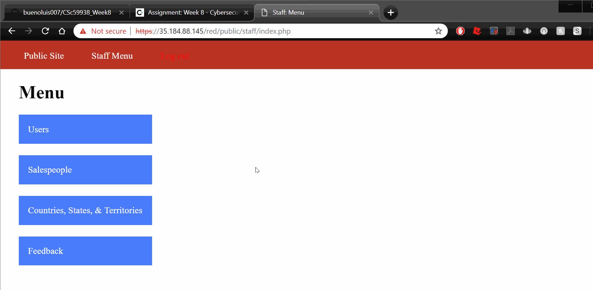
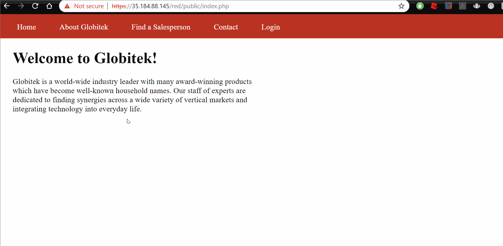
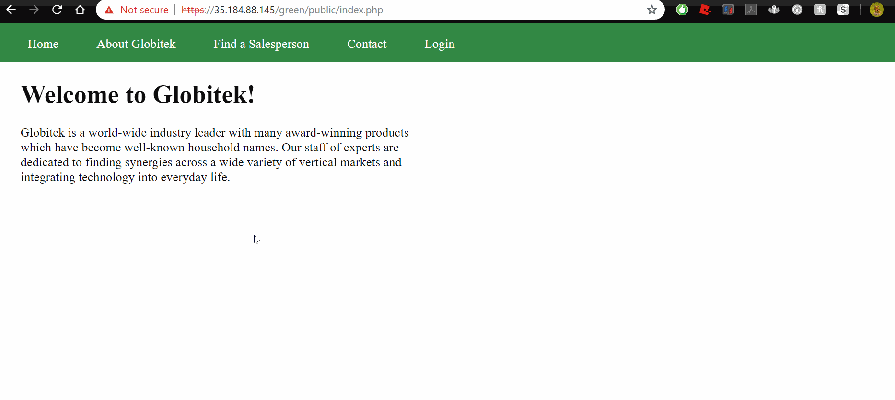

# Project 8 - Pentesting Live Targets

Time spent: **7** hours spent in total

> Objective: Identify vulnerabilities in three different versions of the Globitek website: blue, green, and red.

The six possible exploits are:
* Username Enumeration
* Insecure Direct Object Reference (IDOR)
* SQL Injection (SQLi)
* Cross-Site Scripting (XSS)
* Cross-Site Request Forgery (CSRF)
* Session Hijacking/Fixation

Each version of the site has been given two of the six vulnerabilities. (In other words, all six of the exploits should be assignable to one of the sites.)

## Blue

Vulnerability #1: SQL Injection (SQLi)

Attempting to inject a database query at the end of the URL of a salesperon page with ```'OR 1'--``` causes the database query to fail. This error shows the endless possibilites of potential SQLi. Red and Green properly reroute you when attempting this there.


Vulnerability #2: Session Hijacking/Fixation

Log into your account and add ```/hacktools/change_session_id.php``` to the end of the url. You are able to copy your current session id. On a different browser or private/incognito varient of your current browser, access ```https://35.184.88.145/blue/public/hacktools/change_session_id.php``` and paste the session id obtained from the logged in user and click "Change." Now when you access ```https://35.184.88.145/blue/public/``` and click "Login" on your different/private browser, you are logged in without ever logging in!


## Green

Vulnerability #1: Cross-Site Scripting (XSS)

Press the "Contact" button and start filling out the information. In the Feedback area, type ```<script>alert('Luis found the XSS!');</script>```. Now login and view the "Feedback." An alert will come up on the screen with what you entered before. Blue and Red display the XSS as text instead.


Vulnerability #2: Username Enumeration

When attempting to login as someone who exists in the system like "jmonroe99," the "Log in was unsuccessful" text will be bold. Now when trying to login as someone who doesn't exist, the "Log in was unsuccessful" text will not be bold. This reveals who has an actual account on the website.


## Red

Vulnerability #1: Cross-Site Request Forgery (CSRF)

Download the "csrf.html" file provided on this github and access the Users page when logged in. Take note of who exists in the system. When you open the "csrf.html" file on your computer, it will open a new empty tab. Now refresh the Users page, and the first User (with id=1) has been changed! Tricking someone into to opening this html file is all you need to do to pull off this exploit.



Vulnerability #2: Insecure Direct Object Reference (IDOR)

Click on "Find a Salesperson" and take note of everyone publically on the page. Click on anyone to see details of that person. Change the id in the URL to "10," and you will find the account of someone that shouldn't be public yet! You can go back to the "Find a Salesperson" page and CTRL+F to find that this user actually isn't listed yet. Blue and Green simply redirect you back to the "Find a Salesperson" page when you perform this there.



## Bonus Objective 2: Build on Objective #4 (Cross-Site Scripting)

Like before, press the "Contact" button and start filling out the information. In the Feedback area, type ```<script>document.location="https://www.google.com/"</script>```. This time we are redirecting to user to the website of our choosing (in this case, google). Now login and view the "Feedback." All alerts from previous users will display, and then you will be rerouted to the website of choice. This can easily be used to reroute someone to a malicious website, thus making this very unsecure.



## Notes

No real challenges encountered.

## Resources

GIFs created with [LiceCap](http://www.cockos.com/licecap/).

## License

    Copyright [2018] [Luis Bueno]

    Licensed under the Apache License, Version 2.0 (the "License");
    you may not use this file except in compliance with the License.
    You may obtain a copy of the License at

        http://www.apache.org/licenses/LICENSE-2.0

    Unless required by applicable law or agreed to in writing, software
    distributed under the License is distributed on an "AS IS" BASIS,
    WITHOUT WARRANTIES OR CONDITIONS OF ANY KIND, either express or implied.
    See the License for the specific language governing permissions and
    limitations under the License.

